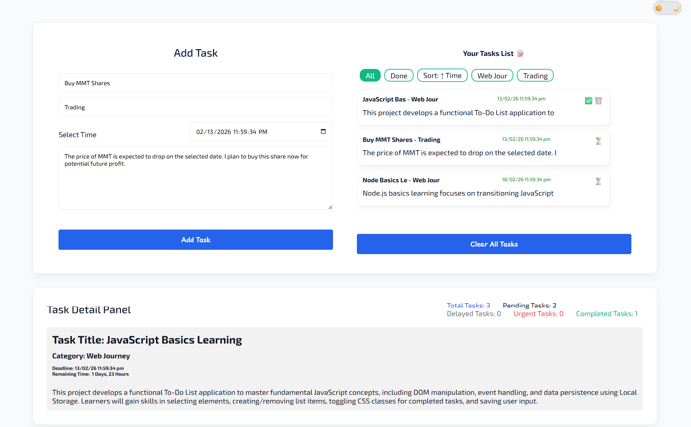

# Task Reminder Dashboard

A lightweight JavaScript-based web application that helps users manage daily and monthly tasks efficiently.  
Supports dark/light themes, category badges, animations, and persistent storage using `localStorage`.

---

## 🔗 Live Demo
[https://muhammad-abdul-hannan.github.io/Task-Reminder-Dashboard/](#)

---

## 🖼 Screenshot
  

---

## 🛠 Technologies Used

- **HTML5**  
- **CSS3** (Media Queries, Animations, Dark/Light Theme)  
- **JavaScript (ES6)**  
- **LocalStorage API** for task persistence  
- **Lottie Animations** for interactive UI elements  

---

## 📁 Folder Structure

task-reminder-dashboard/
│
├── index.html
├── styles/
│ └── style.css
├── js/
│ └── script.js
├── assets/
│ └── Task-Reminder-Dashboard.png, lottie files.
└── README.md


---

## 🎨 Color Palette

### Dark Theme

--bg: #0f172a;
--card: #1e293b;
--text: #f1f5f9;
--muted: #94a3b8;
--border: #334155;
--primary: #3b82f6;
--success: #22c55e;
--danger: #f87171;
--shadow-lg: 0 10px 20px rgba(0, 0, 0, 0.6);
--shadow-sm: 0 4px 12px rgba(0, 0, 0, 0.6);
--border-soft: rgba(255, 255, 255, 0.08);


### Light Theme

--bg: #f9fafb;
--card: #ffffff;
--primary: #2563eb;
--success: #10b981;
--danger: #ef4444;
--text: #111827;
--muted: #6b7280;
--border: #e5e7eb;
--shadow: rgba(0, 0, 0, 0.05);
--shadow-lg: 0 10px 20px rgba(0, 0, 0, 0.05);
--shadow-sm: 2px 5px 10px rgba(0, 0, 0, 0.05);
--border-soft: rgba(128, 128, 128, 0.1);


---

## ✅ Features

- Mobile responsive (media queries)
- Task card styling with hover effects
- Dark/light mode toggle
- Add, edit, delete tasks
- Filter tasks by category
- Sort tasks by time
- Completed tasks section
- LocalStorage schema versioning and migration
- Notifications
- Lottie animations for better UX
- Empty state design

---

## 🚀 How to Run (For Beginners)

1. Clone the repository:

```bash
git clone https://github.com/yourusername/task-reminder-dashboard.git

2. Open the project folder in VS Code (or your editor).

3. Install Live Server extension (VS Code recommended).

4. Right-click index.html → Open with Live Server.

⚠️ Live Server is required for Lottie animations to work properly.


🧠 What I Learned

DOM manipulation and event handling
    Persistent data storage with LocalStorage API
    Responsive design using media queries
    Dark/Light theme toggle using CSS variables
    Task filtering, sorting, and category badges
    Implementing Lottie animations in a web project
    Managing feature-rich JS projects in a clean folder structure


📄 License
MIT License
